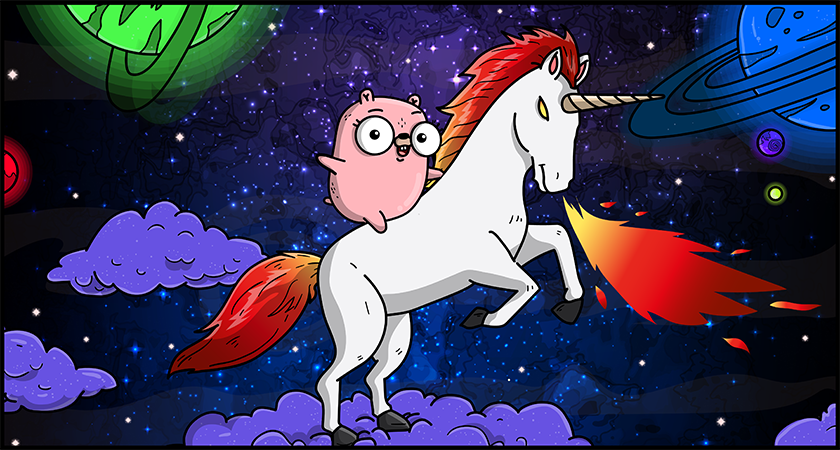

<h1 align="center">danger-go</h1>
<p align="center">
    <a href="https://travis-ci.com/KennethanCeyer/danger-go" target="_blank"></a>
    <a href="http://rubygems.org/gems/danger-go" target="_blank"></a>
    <a href="https://github.com/KennethanCeyer/danger-go/blob/master/LICENSE" target="_blank"></a>
</p>
<p align="center">A Dangerfile for golang developer (golint)</p>
<p align="center"></p>

## Getting Started

### Installation

```bash
$ gem install danger-go
```

### Requirements

Make sure your system has follows requirements

- go
- golint

**golint**

This project uses `golint` as default lint toolchain,
The code will try to install when your system does not have golint tool,
However, If you want to ensure to install golint,
Use follows line. 

```bash
$ go get golang.org/x/lint/golint
``` 

## Usage

### Basic

Put follows line into your `Dangerfile`.

```ruby
golint.lint
```

## Development

### Install

**Clone this repo**

```bash
$ git clone https://github.com/KennethanCeyer/danger-go.git
```

**Run bundler to download dependencies**

```bash
$ bundle install
```

**Run rake spec to test**

```bash
$ bundle exec rake spec
```

**Use guard to automatically have tests run as you make changes**

```bash
$ bundle exec guard
```

## License

This project is under MIT License

MIT License

Copyright (c) 2019 PIGNOSE

Permission is hereby granted, free of charge, to any person obtaining a copy
of this software and associated documentation files (the "Software"), to deal
in the Software without restriction, including without limitation the rights
to use, copy, modify, merge, publish, distribute, sublicense, and/or sell
copies of the Software, and to permit persons to whom the Software is
furnished to do so, subject to the following conditions:

The above copyright notice and this permission notice shall be included in all
copies or substantial portions of the Software.

THE SOFTWARE IS PROVIDED "AS IS", WITHOUT WARRANTY OF ANY KIND, EXPRESS OR
IMPLIED, INCLUDING BUT NOT LIMITED TO THE WARRANTIES OF MERCHANTABILITY,
FITNESS FOR A PARTICULAR PURPOSE AND NONINFRINGEMENT. IN NO EVENT SHALL THE
AUTHORS OR COPYRIGHT HOLDERS BE LIABLE FOR ANY CLAIM, DAMAGES OR OTHER
LIABILITY, WHETHER IN AN ACTION OF CONTRACT, TORT OR OTHERWISE, ARISING FROM,
OUT OF OR IN CONNECTION WITH THE SOFTWARE OR THE USE OR OTHER DEALINGS IN THE
SOFTWARE.
